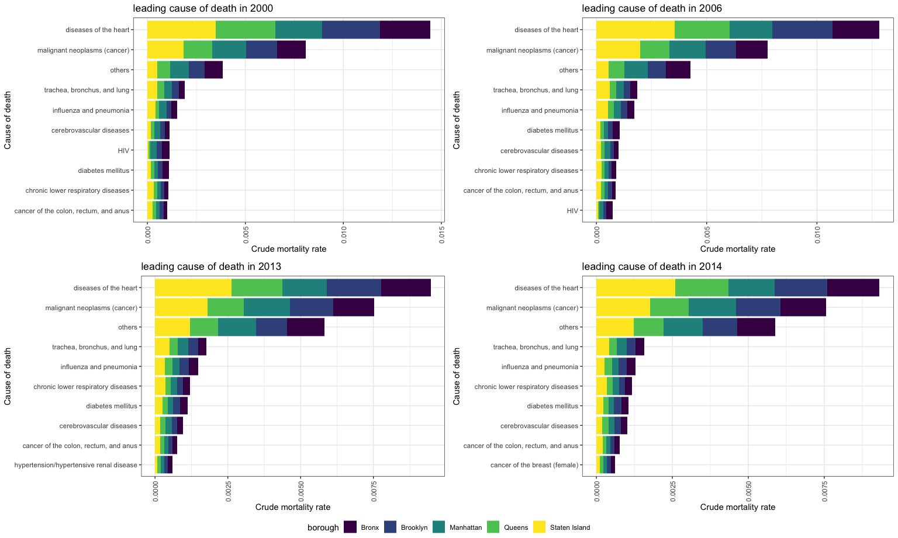

### key findings.

 

**change in cause of death by year**

 - Heart disease and malignant neoplasms (cancer) were by far the most leading cause of death in our selected years. 
 -  HIV dropped out from the top ten while breast cancer emerged as new major causes.
 
  
  
  
  
  
  
 

 
 

**leading cause of death for each race**

- Different race has similar cause of death pattern with heart disease and malignant neoplasms ranked as the leading two causes of death.

-  HIV only appeared in the Hispanic and the Black group while breast cancer is a leading cause in the White only. 

- Accident except poisoning was ranked as 10th for Asians and Hispanics but not in the leading cause list for the other two group. 

  
  
  
  
  
   
  
  
  
  
  
  
  
  

**leading cause of death for different age group**

-  chronic diseas such as heart disease and hypertension were greater risk in aged people

-  higher proportion of premature death was due to homicide, psychoactive substance and HIV.

 
 
 
 
 
 
  
 
 
 
 
 
 
 
 
 

**leading cause of death for different gender**

- heart diseas and malignant neoplasms remained the most two major cause of death.

- gender specific death: Breast cancer and prostate cancer. 

- Lower respiratory disease was more of a risk than male, which could be expained by a larger proportion of smoking population in male. 

- HIV was a greater issue for male and cancer of colon was unique in top ten causes for female

